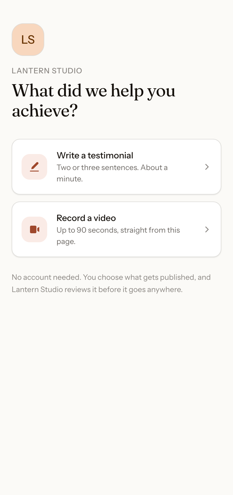
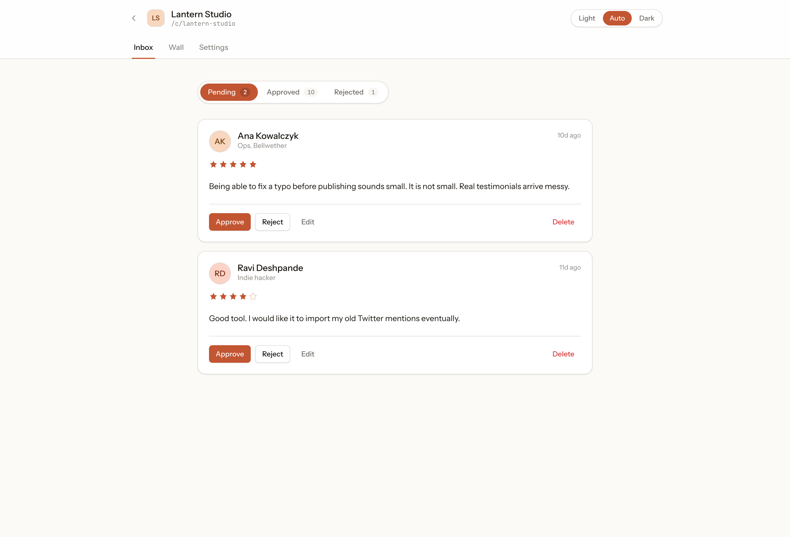
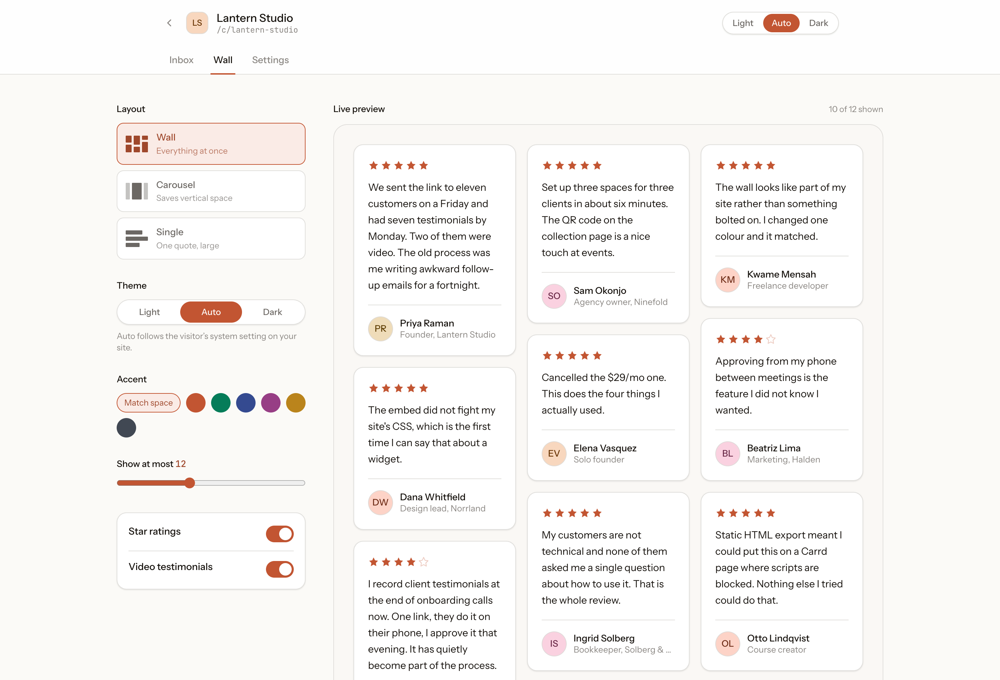
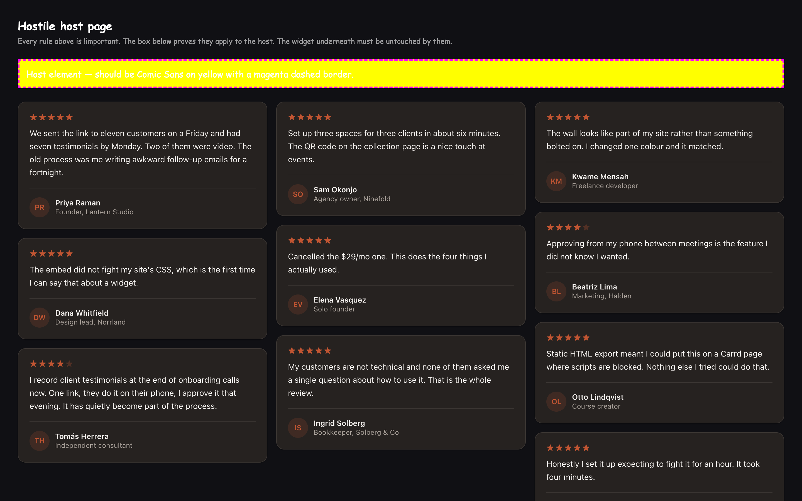
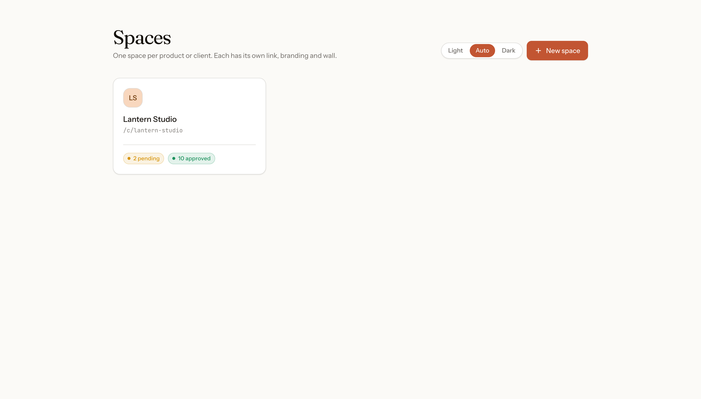

<div align="center">


# Vouch

**Collect text and video testimonials through a link you send, approve the good ones, and embed a wall on your site with one script tag.**

Replaces [Senja](https://senja.io) and [Testimonial.to](https://testimonial.to) — **$29/mo → free**, self-hostable on a free Supabase and Vercel tier.

Built for the Build Games, September 2026.

</div>

---

## The job it does

Senja and Testimonial.to are large products, but the job people pay for is narrow. Vouch does those four things and stops.

| | |
|---|---|
| **Ask** | One branded link. The person writing your testimonial never signs in, never installs anything, and can finish on a phone in one hand. |
| **Capture** | Text with a star rating, or video recorded in the browser — the thing a Google Form cannot do. |
| **Curate** | Everything lands as pending. Approve, reject, or fix the typos real testimonials arrive with. |
| **Display** | Three layouts, one script tag, and a wall that doesn't look bolted on. |

No importers, no email sequences, no Zapier, no billing. [The out-of-scope list is the contract.](DESIGN.md)

---

## The loop

### 1 · Someone writes you a testimonial



Mobile is the primary target — most people open this link on a phone. Video records in-browser with a countdown, a visible timer, a 90-second cap and a re-record step. No account, no app.

### 2 · You approve it



Pending, approved and rejected. Editing matters: real testimonials arrive with typos and owners want to fix them before they go public.

### 3 · You embed the wall



Layout, theme, accent, item count — with a live preview rendering the **actual widget**, not a mockup. Then copy one line:

```html
<script src="https://vouch.app/embed.js" data-wall="wal_abc123" async></script>
```

---

## How the embed works

The widget is **4.8 kB gzipped** — vanilla TypeScript, no dependencies, rendered into a shadow root.



That page sets `font-family: Comic Sans`, `background: yellow` and `border: 3px dashed magenta` on every element, all `!important`. The yellow box proves the rules apply. The wall below it is untouched.

One subtlety worth knowing if you build something similar: **a shadow root protects its contents, but the host element still lives in the page's DOM.** `:host` loses to the outer document, so `div { background: yellow !important }` paints straight through. The host element is pinned from the style attribute with `all: initial !important` — inline `!important` is the only thing that beats an author `!important`. [`public/embed-test.html`](public/embed-test.html) exists to catch exactly that regression.

**Fallbacks**, because not every site allows scripts:

- **Static HTML export** — self-contained markup and inline CSS for Carrd, Notion, or anywhere JavaScript is blocked
- **iframe** — for platforms that only accept an embed URL; reports its own height to the parent

**Carousel templates** — `rail` (snap scroll), `marquee` (CSS-only infinite loop, pauses on hover, stops under `prefers-reduced-motion`), and `spotlight` (centre card in focus, neighbours scaled and faded).

---

## Design



- **One accent variable.** `--v-accent` is the only brand colour; hover, press, soft, line, text and focus-ring tints all derive from it with `color-mix`. A space owner picks one colour and cannot produce an unreadable pairing — the same mechanism brands the collection page and the embedded wall.
- **Fraunces** for display, with the `WONK` and `SOFT` axes on. **Instrument Sans** for UI. No Inter.
- **Three shadow levels**, not seven. Anything wanting a fourth gets a border.
- **One motion moment** — cards settling into the wall. Everything else is a 120–220ms colour transition.
- Warm oklch neutrals, so surfaces read as paper rather than default grey.

Full rationale and the rules that go with it: **[DESIGN.md](DESIGN.md)**.

---

## Security model

Authenticated owners talk to tables directly, with RLS scoping every row to `auth.uid()`. **Anonymous visitors get no table access at all** — the entire public surface is four `security definer` functions:

| Function | Used by |
|---|---|
| `collection_space(slug)` | the collection page — public fields only, never `user_id` |
| `submit_testimonial(…)` | the submission form — forces `status = 'pending'`, requires consent |
| `wall_payload(wall_id)` | the embed endpoint — config plus approved rows in one round trip |
| `record_wall_view(…)` | the widget — one raw count, nothing else |

Two consequences: there is deliberately **no INSERT policy on `testimonials`**, so a submission cannot be forged as approved; and consent is a check constraint, not just a checkbox.

---

## Running it

```bash
npm install
npm run dev
```

That's enough to browse everything. With no Supabase environment variables set, the app runs in **local mode** against a localStorage-backed data layer, and `/app` opens without signing in. Recorded video goes to IndexedDB.

Every function in that layer has the exact name, arguments and return type of the Supabase RPC it stands in for, so wiring the real backend is an adapter swap rather than a rewrite.

For real auth and Postgres, follow **[SETUP.md](SETUP.md)** — the Supabase project, the Google OAuth client and the environment variables all need your own credentials.

---

## Status

Day 3 of 28. Every screen in the spec is built and the loop works end to end.

**Honest caveats**, because you'll find them anyway:

- The script-tag and iframe embeds currently resolve only against `/api/walls/demo`, which is server-served. A wall created in the builder needs Supabase before its snippet renders on someone else's site. The static HTML export has no such limit.
- The migrations have not yet been run against a real Postgres.
- Video capture is built — `MediaRecorder`, countdown, timer, 90s cap, re-record, poster frame — but has not been exercised on a physical iPhone. Safari hands back mp4 where Chrome and Firefox hand back webm; Vouch stores whatever the browser gives it and serves it back as-is, with no transcoding.

---

## Layout

```
widget/embed.ts                   the embed widget -> public/embed.js
app/api/walls/[id]/               wall JSON + view count
app/globals.css                   token layer (read DESIGN.md before touching)
app/page.tsx                      marketing page
app/app/                          dashboard, inbox, wall builder, settings
app/c/[slug]/                     public collection page
app/styleguide/                   component gallery
components/ui/                    primitives
components/collect/               video recorder
components/wall/wall-render.tsx   the wall; the widget is a port of this
lib/data/store.ts                 local data layer, mirrors the RPC contract
lib/data/blobs.ts                 recorded video in IndexedDB
lib/export-html.ts                static HTML and iframe generators
supabase/migrations/              schema, RLS, storage
scripts/screenshots.mjs           regenerates the images above
```

| Route | |
|---|---|
| `/` | marketing page |
| `/app` | spaces, with a one-click demo space |
| `/app/[space]/inbox` | approve, reject, edit, delete |
| `/app/[space]/wall` | layout, theme, accent, live preview, three embed formats |
| `/app/[space]/settings` | branding, prompt, toggles, collection link, QR code |
| `/c/[slug]` | public collection page |
| `/styleguide` | the design system |
| `/embed-test.html` | hostile host page |
| `/embed-layouts.html` | every layout and carousel style |
